# Тестування працездатності системи

Для тестування системи використовувся Postman  

Був реалізований доступ до наступних таблиць: Role, Grant, RoleGrant

## Role

### Додавання нової сутності (POST)

Спробуємо додати сутність ***не вказавши тіло запиту***:

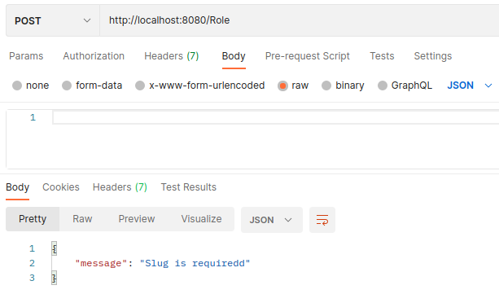  

Додамо у запит [slug](../../design/README.md#role) :

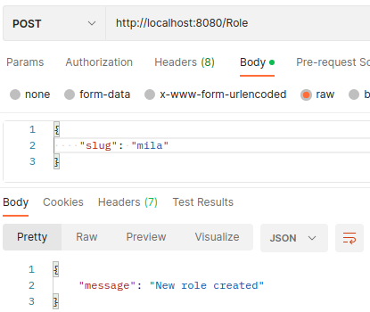  

Спробуємо додати ту ж саму сутність ***ще раз***:

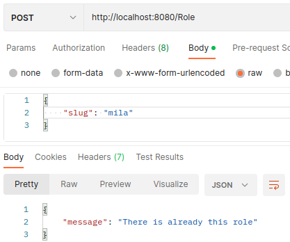  

### Відображення сутностей (GET)

Відобразимо ***усі*** сутності:

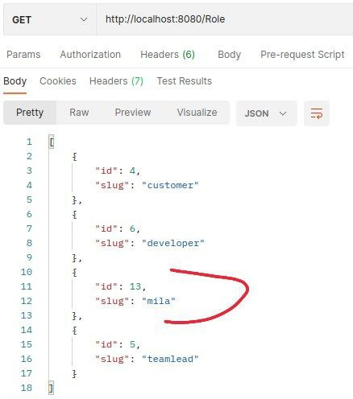  

Відобразимо сутність за обраним ***id*** :

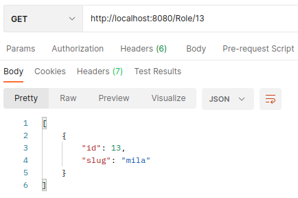  

### Видалити сутність (DELETE)

Видалимо сутність вказавши її ***id*** :

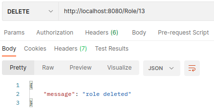  

Спробуємо видалити вже видалену сутність ***ще раз***:

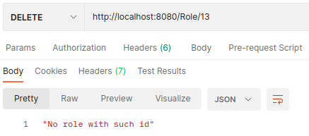  

## Grant

### Додавання нової сутності (POST)

Спробуємо додати сутність ***не вказавши тіло запиту***:

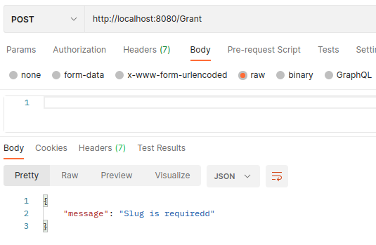  

Спробуємо додати ***вже існуючу*** сутність:

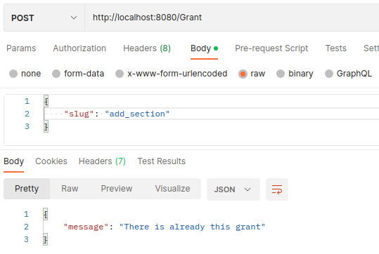  

Додамо у запит [slug](../../design/README.md#grant) :

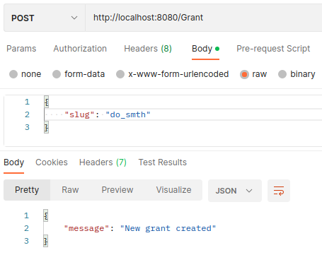  

### Відображення сутностей (GET)

Відобразимо ***усі*** сутності:

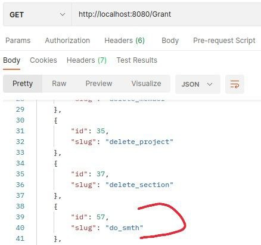  

Відобразимо сутність за обраним ***id*** :

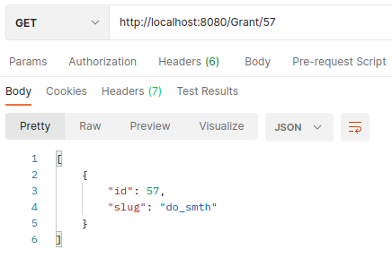  

### Видалити сутність (DELETE)

Видалимо сутність вказавши її ***id*** :

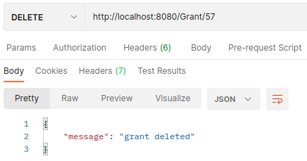  

Спробуємо видалити вже видалену сутність ***ще раз***:

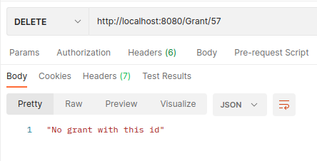  

## RoleGrant

### Додавання нової сутності (POST)

Спробуємо додати сутність ***не вказавши тіло запиту***:

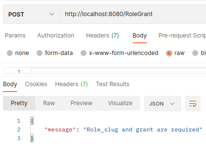  

Спробуємо додати сутність ***з роллю, що не належить до таблиці Roles***:

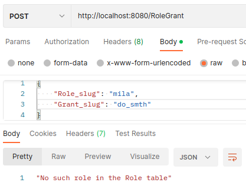  

Створимо відповідну роль, як показано [тут](#addRole)  
Спробуємо додати сутність ***з ґрантом, що не належить до таблиці Grant***:  

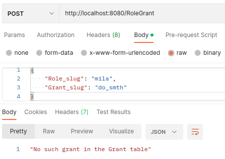  

Створимо відповідний ґрант, як показано [тут](#addGrant)  
Тепер спробуємо додати сутність ще раз :

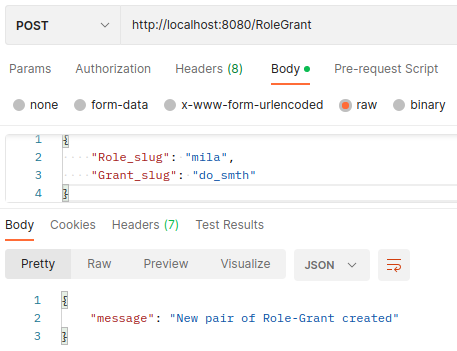  

Спробуємо додати цю сутність ***ще раз***:

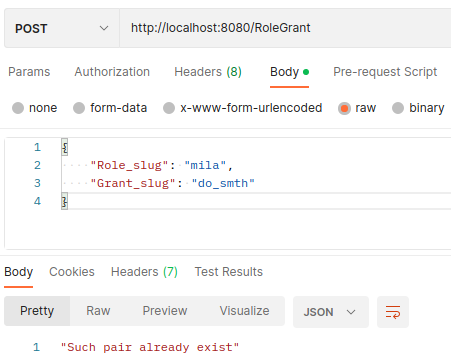  

### Відображення сутностей (GET)

Відобразимо ***усі*** сутності:

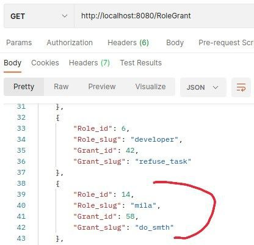  

Відобразимо сутності за ***Role_id***  :

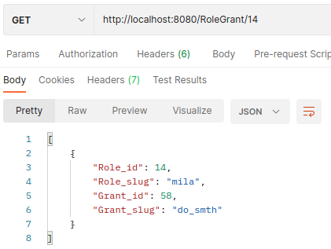  

Ще один приклад:

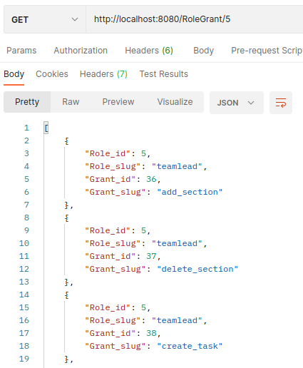  

### Видалити сутність (DELETE)

Видалимо сутність вказавши її ***Role_id*** та ***Grant_id***:

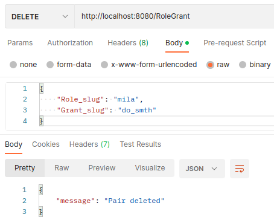  

Спробуємо видалити вже видалену сутність ***ще раз***:

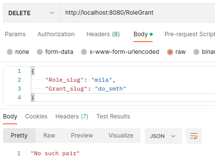  

